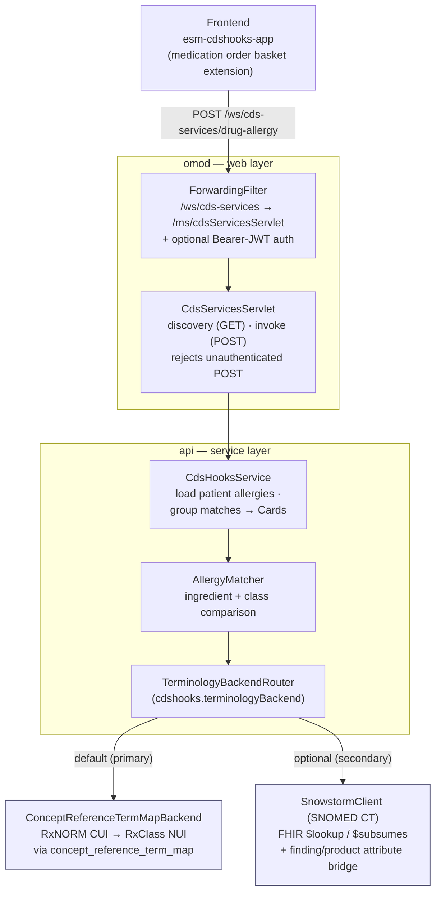
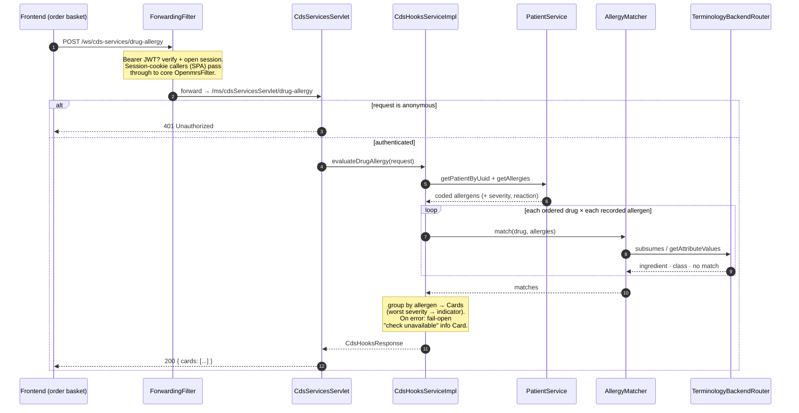

# OpenMRS CDS Hooks Module

Exposes OpenMRS as a [CDS-Hooks 2.0](https://cds-hooks.hl7.org/2.0/) service host.
The first bundled service is a **drug-allergy alert** that warns prescribers
when an ordered drug conflicts with the patient's recorded allergies — both on
ingredient and on drug class.

The allergens come from the patient's **drug allergen list**
(`patientService.getAllergies`), not from findings/conditions, and drug→class
relationships are resolved from **RxClass/RxNORM edges loaded into
`concept_reference_term_map`**. A live SNOMED CT (Snowstorm) bridge is available
as an optional, secondary path for long-term completeness.

## Architecture

### Components

How a request travels from the order basket down to a terminology lookup:



### Request lifecycle

What happens on a single invocation, including the auth gate and the fail-open
fallback:



**Primary path — RxClass/RxNORM via `concept_reference_term_map`.** Drug and
allergen concepts carry RxNORM CUI and/or RxClass NUI reference terms. The
matcher compares those codes directly:

- **Ingredient match** — drug and allergen resolve to the same code.
- **Class match** — an allergen class NUI subsumes the drug ingredient CUI
  (e.g. *amoxicillin (CUI) NARROWER-THAN penicillins (NUI)*), walked through the
  `NARROWER-THAN` / `BROADER-THAN` / `SAME-AS` edges in
  `concept_reference_term_map`. No terminology server required.

**Secondary path — SNOMED CT attribute bridge (optional).** When a Snowstorm
backend is configured, the matcher additionally bridges the allergen *finding*
hierarchy and the drug *product* hierarchy into the *substance* hierarchy via
`Causative agent` (SCTID 246075003) and `Has active ingredient` (SCTID
127489000), then runs substance × substance `$subsumes`. This adds coverage
where SNOMED modelling is richer than the loaded reference-map edges — a
longer-term completeness goal rather than the default path.

New to the terminology? [`docs/TERMINOLOGY_PRIMER.md`](docs/TERMINOLOGY_PRIMER.md)
explains SNOMED CT, RxNorm, RxClass, and CIEL from scratch, with diagrams of the
two matching paths. See [`docs/REFERENCE_MAP_BACKEND.md`](docs/REFERENCE_MAP_BACKEND.md)
for the primary path, [`docs/DESIGN.md`](docs/DESIGN.md) for the full design
proposal, and [`docs/IMPLEMENTATION_NOTES.md`](docs/IMPLEMENTATION_NOTES.md) for
contributor notes (local setup, SNOMED modeling findings, and OpenMRS-platform
gotchas).

## Module structure

```
.
├── api/                          # Service layer
│   ├── src/main/java/.../cdshooks/
│   │   ├── api/                  # Service interfaces (CdsHooksService, AllergyMatcher)
│   │   ├── api/impl/             # Service + matcher impl, request parser, severity/audit
│   │   ├── client/               # Snowstorm FHIR client + TTL cache
│   │   ├── terminology/          # Pluggable subsumption backends (Snowstorm / reference-map)
│   │   ├── model/                # CDS-Hooks request/response DTOs
│   │   └── CdsHooksConstants.java
│   └── src/main/resources/moduleApplicationContext.xml
├── omod/                         # Web layer
│   └── src/main/
│       ├── java/.../cdshooks/
│       │   ├── CdsHooksActivator.java
│       │   └── web/
│       │       ├── servlet/CdsServicesServlet.java   # CDS-Hooks discovery + invocation
│       │       └── filter/ForwardingFilter.java      # /ws/cds-services URL + bearer auth
│       └── resources/config.xml
├── frontend/esm-cdshooks-app/    # ESM micro-frontend (drug-allergy alert extension)
└── e2e/                          # Playwright end-to-end tests
```

## Build

Requires Java 11+ and Maven 3.6+. Build with:

```bash
mvn clean install
```

The OMOD will be at `omod/target/cdshooks-1.0.0-SNAPSHOT.omod`.

## Local development

The `dev/` directory holds Docker Compose stacks for running the module against
a real OpenMRS RefApp. These reference the official published OpenMRS images;
nothing is bundled in this repo.

```bash
# Full OpenMRS RefApp 3 stack (gateway + frontend + backend + MariaDB)
docker compose -p cdshooks-dev -f dev/docker-compose.yml up -d
# Frontend:    http://localhost:8081/openmrs/spa
# REST/FHIR:   http://localhost:8081/openmrs/ws/...
# Credentials: admin / Admin123
```

After building, deploy the OMOD into the running backend:

```bash
docker cp omod/target/cdshooks-omod-1.0.0-SNAPSHOT.omod \
  cdshooks-dev-backend-1:/openmrs/data/modules/cdshooks-1.0.0-SNAPSHOT.omod
docker restart cdshooks-dev-backend-1
```

`dev/docker-compose.snowstorm.yml` brings up a local Snowstorm terminology
server for offline or write-access use; see its header for SNOMED release
loading. See [`docs/IMPLEMENTATION_NOTES.md`](docs/IMPLEMENTATION_NOTES.md) for
the full walkthrough.

## Configuration

Global properties:

| Property | Default | Description |
|---|---|---|
| `cdshooks.terminologyBackend` | `referenceMap` | Source for parent-child / subsumption lookups: `referenceMap` (default — local `concept_reference_term_map`, e.g. RxClass NUI/CUI edges), `snowstorm` (live FHIR + SNOMED attribute bridge, secondary), or `both`. See [docs/REFERENCE_MAP_BACKEND.md](docs/REFERENCE_MAP_BACKEND.md). |
| `cdshooks.snowstormUrl` | `https://tx.fhir.org/r4` | Base FHIR URL of the SNOMED terminology server (only used by the `snowstorm`/`both` backends) |
| `cdshooks.snomedSystem` | `http://snomed.info/sct` | FHIR system URI for SNOMED CT codes |
| `cdshooks.cacheTtlSeconds` | `3600` | TTL for cached terminology lookups |

## Compatibility

- OpenMRS Platform 2.6+
- FHIR2 module 2.4+
- Primary path: RxClass/RxNORM edges loaded into `concept_reference_term_map`
  (via `openmrs-module-initializer`) — no terminology server required
- Optional secondary path: SNOMED CT via Snowstorm (any version exposing the
  `Causative agent` and `Has active ingredient` attributes — i.e. modern editions)
