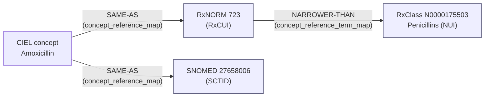
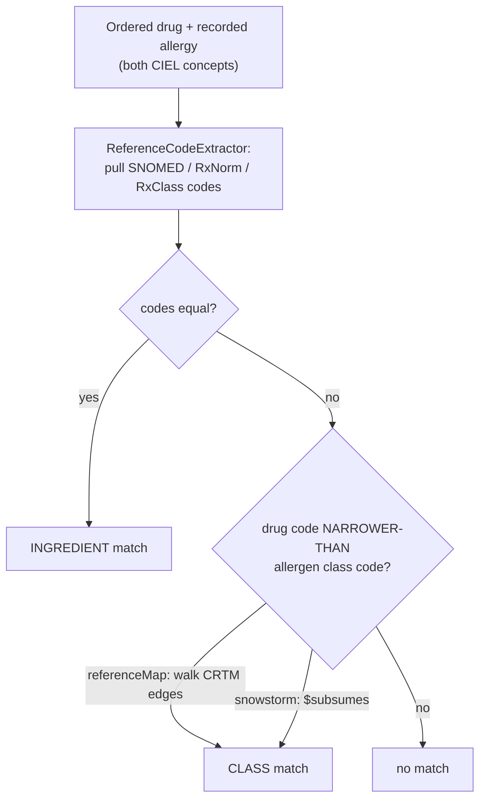

# Terminology primer: SNOMED CT, RxNorm, RxClass, CIEL

A from-scratch explanation of the coding systems this module bridges, why there
are several, and how they snap together to answer one question: *does the
ordered drug conflict with a recorded allergy?* This is background reading for
[`REFERENCE_MAP_BACKEND.md`](REFERENCE_MAP_BACKEND.md) and [`DESIGN.md`](DESIGN.md).

The running example throughout: **a patient is allergic to *Penicillins*; a
clinician orders *Amoxicillin*.** Amoxicillin is a penicillin, so this should
warn — and a computer can only know that if the drug and the allergy carry
stable codes whose relationship is recorded somewhere.

## The core problem

A rule like *"warn if the drug is a penicillin and the patient is allergic to
penicillins"* needs two things software can act on:

1. **Stable codes** for concepts — "Amoxicillin" as a specific identifier, not a
   spelling.
2. **Relationships between those codes** — so the system knows Amoxicillin
   *is-a* Penicillin.

The systems below are different authorities' answers to *"what are the codes,
and what are the relationships?"* They overlap; none is wrong; you map between
them.

## The systems at a glance

| System | What it is | Identifier | Role here |
|---|---|---|---|
| **SNOMED CT** | Big multinational clinical ontology (findings, substances, products, …) with a built-in is-a hierarchy | **SCTID** (e.g. `27658006`) | Secondary "long-term completeness" path; needs a server (Snowstorm) |
| **RxNorm** | US NLM normalized drug/ingredient vocabulary | **RxCUI** (e.g. `723`) | Drug/ingredient *identity* — the child node in a class match |
| **RxClass** | NLM resource linking RxNorm drugs to drug *classes* | class **NUI** (e.g. `N0000175503`) | Where "Amoxicillin is a Penicillin" comes from |
| **CIEL** | The OpenMRS concept dictionary; maps its concepts out to all of the above | OpenMRS concept | The hub clinicians actually pick concepts from |

### SNOMED CT
*Systematized Nomenclature of Medicine — Clinical Terms.* Covers **everything** —
diseases, findings, procedures, organisms, substances, drug products. Two things
make it powerful:

- A rich **is-a hierarchy** (subsumption): Amoxicillin *is-a* Penicillin *is-a*
  Beta-lactam.
- **Attribute relationships** beyond is-a — e.g. a *finding* "Allergy to
  penicillin" has a **Causative agent** → the substance Penicillin; a *product*
  "Amoxicillin tablet" has a **Has active ingredient** → the substance
  Amoxicillin.

Codes are numeric **SCTIDs**. Licensed by SNOMED International; free in member
countries and many low/middle-income countries. **Snowstorm** is the
open-source server that answers queries over FHIR (`$subsumes`, `$lookup`).
This powers the module's *secondary* path.

### RxNorm
US National Library of Medicine's normalized drug vocabulary (US-centric, free,
public). Its job is to give every clinical drug/ingredient **one** normalized
identity regardless of spelling or brand. Codes are **RxCUI**s (CUI = *Concept*
Unique Identifier). It is mostly about drug/ingredient identity — **not** itself
a class hierarchy.

### RxClass
Also NLM. This is the piece that adds **drug → drug-class** relationships on top
of RxNorm, pulling class systems (ATC, MeSH, FDA established pharmacologic
class, MED-RT, VA…). Drug **classes** are identified by **NUI** (Name Unique
Identifier). RxClass is where you learn:

```
RxCUI 723 (Amoxicillin, ingredient)  ──member-of──▶  NUI N0000175503 (Penicillins, class)
```

That single edge powers a class match **without SNOMED at all**. Andrew Kanter's
phrase *"the RxClass relationship between the NUI and the RxNORM CUI"* refers to
exactly this.

### CIEL
*Columbia International eHealth Laboratory* dictionary — **not** a coding system
like the three above, but the curated **concept dictionary OpenMRS runs on**.
When a clinician picks "Amoxicillin" in OpenMRS, they pick a *CIEL concept*.
CIEL's value is that each concept carries **mappings out** to the external code
systems: a CIEL drug concept typically maps to a SNOMED code *and* an RxNorm
code (often ATC/WHO too). CIEL is the hub; SNOMED/RxNorm/RxClass are the external
authorities it points at.

> ⚠ **The catch the spike found:** CIEL coverage is uneven. Acetaminophen (CIEL
> 70116) is richly mapped; Amoxicillin (CIEL 71160) had **zero** reference-term
> mappings on the dev server. A path that depends on a code being present can
> silently fail to fire — a key reason this module defaults to the RxClass/RxNorm
> path, the mapping CIEL most reliably carries for drugs.

## How OpenMRS stores the mappings (the part that trips people up)

OpenMRS core has **two different mapping tables**, and the distinction is the
whole ballgame:

**1. `concept_reference_map` (ConceptMap) — concept → external term.**
"This CIEL concept *equals* this external code."

```
CIEL "Amoxicillin"  ──SAME-AS──▶  RxNORM 723
CIEL "Amoxicillin"  ──SAME-AS──▶  SNOMED 27658006
```

This is what `ReferenceCodeExtractor` reads — it walks a concept's mappings and
pulls out the SNOMED / RxNorm / RxClass codes.

**2. `concept_reference_term_map` (ConceptReferenceTermMap) — term → term.**
"This external code *relates to* that external code." This is the table for
**hierarchies and relationships between codes**, and the one this module's
default path depends on:

```
RxNORM 723 (Amoxicillin)  ──NARROWER-THAN──▶  RxClass N0000175503 (Penicillins)
```

Both tables use **map types** to say what kind of relationship it is:

- **SAME-AS** — equivalence (same thing, two code systems).
- **NARROWER-THAN** — left code is a *child* (more specific). Amoxicillin
  NARROWER-THAN Penicillins.
- **BROADER-THAN** — the reverse.

Andrew's proposal in one sentence: **load the RxClass NUI↔CUI edges into
`concept_reference_term_map` as NARROWER-THAN rows, and have a service walk them
to answer "is this drug a member of that class?"** That service is
`ConceptReferenceTermMapBackend.subsumes()`.

### How the tables relate



`concept_reference_map` gets you *from* a CIEL concept *to* its codes;
`concept_reference_term_map` records the **class hierarchy between codes**.

## The two matching paths, end to end

Same clinical goal — *patient allergic to Penicillins, clinician orders
Amoxicillin → warn* — two ways to get there.

### Path A — RxClass via `concept_reference_term_map` (default, primary)

No server; everything is local in the OpenMRS database.

```
Allergen "Allergy to penicillin" (CIEL) ──maps to──▶ RxClass NUI N0000175503 (Penicillins)
Drug     "Amoxicillin"            (CIEL) ──maps to──▶ RxNORM CUI 723
                                                          │
        walk concept_reference_term_map: is 723 NARROWER-THAN N0000175503?
                                                          │
                                                          ▼
                                                    yes → CLASS MATCH
```

Deterministic, offline, auditable, and uses the mapping CIEL most reliably has.
Cost: someone must **load and maintain** the RxClass edges (NUIs change across
RxClass releases — see open questions in `REFERENCE_MAP_BACKEND.md`).

### Path B — SNOMED attribute bridge (secondary, "long-term completeness")

Needs a live Snowstorm server. Bridges allergen *findings* and drug *products*
to their substances, then asks SNOMED for subsumption.

```
Allergen "Allergy to penicillin" (SNOMED finding 91936005)
    └─ Causative agent ───────▶ Penicillin (substance)
Drug "Amoxicillin product"       (SNOMED product)
    └─ Has active ingredient ──▶ Amoxicillin (substance)
                                       │
            ask Snowstorm: does Penicillin $subsumes Amoxicillin?
                                       │
                                       ▼
                                 yes → CLASS MATCH
```

Clinically complete, but depends on findings-style modelling, a running
terminology server, and SNOMED coverage CIEL often lacks for drugs. Andrew:
*"most people expect the drug allergen list, not findings/conditions… to be
complete that'd be a good long-term goal."* Hence: secondary.

### Ingredient match (the 1:1 floor, both paths)

The simplest case — the patient is allergic to *Amoxicillin specifically* and
Amoxicillin is ordered — is identical on both paths: the drug's code equals the
allergen's code directly (`RxCUI 723 == RxCUI 723`). This is the minimal exact
match Ian Bacher framed as the floor; class matching layers on top.



## One-line mental model

- **SNOMED CT** = giant clinical ontology with built-in is-a hierarchy (needs a
  server).
- **RxNorm** = normalized drug *identities* (RxCUI).
- **RxClass** = drug → *class* memberships on top of RxNorm (class = NUI).
- **CIEL** = the OpenMRS dictionary that maps its concepts *out* to all of the
  above.
- **`concept_reference_map`** = concept→code; **`concept_reference_term_map`** =
  code→code relationships (where the RxClass hierarchy is stored).
- **This module's default** = resolve drug→class through RxNorm-CUI →
  RxClass-NUI edges in `concept_reference_term_map`; the SNOMED bridge is the
  longer-term completeness path.
